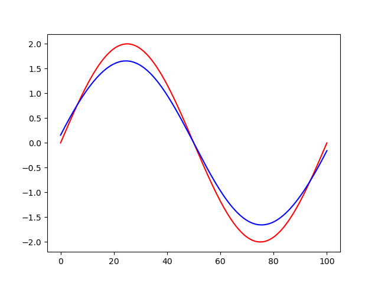
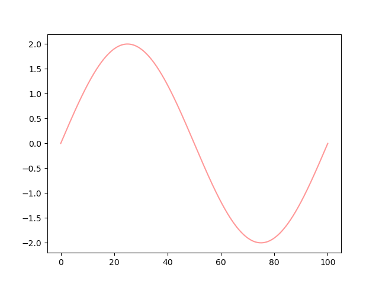

# kernel_regression
Rewriting of statsmodels' kernel regression functions for speed. 

The main motivation behind this is the interpolation of missing values over large amount 
of time series. Vanilla interpolation approaches can give too much estimation variance or 
be vulnerable to data quality issues.

Single-threaded Nadarawa-Watson fit is about 150 times faster than the Python alternative. 
There is also a multi-threaded implementation of the local polynomial estimator. 

At the moment, multivariate kernels with unordered and continuous variables are handled. 

Because of the performance improvement, cross-validations and fittings of local multivariate polynomials 
are within reach. 

# How to compile the python wheel (Linux)
- Make sure Rust, along with Cargo, is accessible in your terminal. 
- The models are currently developped for Python 3.11
- Install *maturin* in your Python environment with 
```bash
pip install maturin
```
- At the root of the *py-kernel-regression* module, run 
```bash
maturin develop --release 
```
This is will compile the wheel and install py-kernel-regression in your Python environment. 
If you only want to get the wheel, use 
```bash
maturin build --release
``` 
instead. 

# Example usage
## Basic example
```python
import numpy as np
from py_kernel_regression import KernelReg as KR

bw = [1.0, 0.2]
x_train = np.array([1.0, 3.2, 2.5, 1.2, 4.3])[:, None]
u_train = np.array([1, 3, 2, 2, 1])[:, None]
X_train = np.concatenate([x_train, u_train], axis=1)
Y_train = np.array([9.0, 9.0, 10.0, 3.0, 4.0])

x_new = np.array([[1.0, 2.0], [2.2, 3.0], [2.6, 2.0]])

ll_output = KR(bw, ["c", "u"], "loc_constant").fit_predict(Y_train, X_train, x_new)

print(ll_output)
```

## Leave-one-out cross-validation
```python
import numpy as np
n = 1000 
x = np.linspace(0, 100, n)
y = np.array([2.0 * np.sin(x_i * np.pi/50) for x_i in x])

exog = x[:, None] 
endog = y.ravel()

y_hat = KR([10.0], ["c"], "loc_linear").fit_predict(endog, exog, exog)
```



```python
grid_bw = [0.5, 1.0, 5.0, 10.0, 25.0, 50.0, 100.0]
losses = []
for bw in grid_bw:
    loss = KR([bw], ["c"], "loc_linear").leave_one_out(endog, exog, "rmse")
    losses.append(loss)
 
 
y_hat = KR([np.argmin(grid_bw)], ["c"], "loc_linear").fit_predict(endog, exog, exog)
```



# Notes
- Got to improve/actually do error handling. Right now it's very unclear why/where there is an issue (e.g. too many variables declared).

